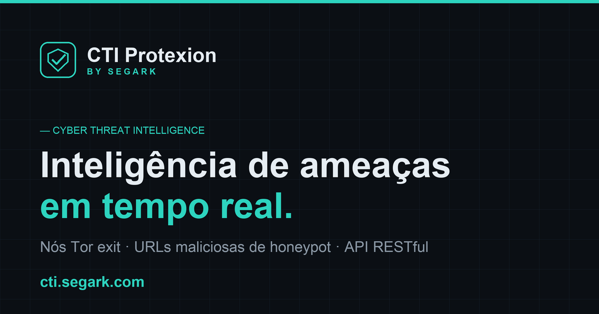

<div align="center">



<br/>
<br/>

# CTI Protexion · by Segark

**Inteligência de ameaças cibernéticas em tempo real sobre a rede Tor.**

Feeds de nós Tor exit e de URLs maliciosas capturadas por honeypot, entregues por uma API RESTful pronta para integração.

<br/>

[](https://python.org)
[](https://flask.palletsprojects.com/)
[](https://gunicorn.org/)
[](docker/Dockerfile)
[](LICENSE)
[](https://cti.segark.com)

[**Acessar serviço**](https://cti.segark.com) &nbsp;·&nbsp; [Instalação](#instalação) &nbsp;·&nbsp; [API](#endpoints-da-api) &nbsp;·&nbsp; [Docker](#docker) &nbsp;·&nbsp; [Contato](#contato)

</div>

---

## Visão geral

O **CTI Protexion** consolida inteligência de ameaças a partir de fontes confiáveis e a expõe por uma API simples e estável. Os dados de nós Tor vêm diretamente do Tor Project; as URLs maliciosas são capturadas por um honeypot Cowrie. O serviço é resiliente: quando o banco do honeypot está indisponível, os feeds continuam respondendo com uma resposta limpa — sem vazar erros de conexão.

> **Serviço em produção:** [cti.segark.com](https://cti.segark.com)

### Sumário

[Recursos](#recursos) · [Stack](#stack) · [Instalação](#instalação) · [Docker](#docker) · [Endpoints da API](#endpoints-da-api) · [Exemplos](#exemplos) · [Configuração](#configuração) · [Estrutura](#estrutura-do-projeto) · [Fonte dos dados](#fonte-dos-dados) · [Contribuição](#contribuição) · [Licença](#licença) · [Contato](#contato)

---

## Recursos

| | |
|---|---|
| **Atualização automática** | Cache de nós exit renovado a cada 12h; dados detalhados a cada 5min, em background. |
| **Fontes oficiais** | Dados direto da API do Tor Project (Onionoo e exit-addresses). |
| **Honeypot** | URLs maliciosas capturadas pelo Cowrie, com domínios legítimos filtrados. |
| **Degradação graciosa** | Banco indisponível? O feed responde vazio e limpo, sem vazar erros. |
| **API RESTful** | Múltiplos formatos de saída: JSON, TXT e RSS. |
| **Rate limiting** | Por IP, em memória. |

---

## Stack

| Camada | Tecnologia |
|--------|------------|
| Backend | Python 3.12 · Flask |
| Servidor | Gunicorn (3 workers) |
| Dados Tor | Tor Project — Onionoo + exit-addresses |
| Honeypot | Cowrie · MySQL (opcional) |
| Cache | Em memória, com TTL |
| Rate limiting | Flask-Limiter (por IP, in-memory) |
| Frontend | HTML · CSS · JS — fontes self-hosted (Inter · JetBrains Mono) |
| Deploy | Docker |

---

## Instalação

**Pré-requisitos:** Python 3.12+ e pip.

```bash
git clone https://github.com/dathannobrega/tor-nodes.git
cd tor-nodes/app
pip install -r requirements.txt
python main.py
```

| Recurso | URL local |
|---------|-----------|
| Interface web | http://localhost:8000 |
| Lista de IPs Tor | http://localhost:8000/tornodes-ip.txt |
| URLs do honeypot | http://localhost:8000/honeypot-urls.txt |

### Docker

```bash
# Build
docker build -t cti-protexion -f docker/Dockerfile .

# Run (healthcheck em /health, porta 8000)
docker run -d --name cti -p 8000:8000 cti-protexion
```

### Produção (Gunicorn)

```bash
gunicorn --bind 0.0.0.0:8000 --workers 3 main:app
```

---

## Endpoints da API

| Método | Rota | Descrição | Formato |
|:------:|------|-----------|:-------:|
| `GET` | `/` | Página inicial com documentação | HTML |
| `GET` | `/health` | Healthcheck para orquestradores | JSON |
| `GET` | `/tornodes-ip.txt` | IPs dos nós Tor exit | Texto |
| `GET` | `/honeypot-urls.txt` | URLs maliciosas (últimos 30 dias) | Texto |
| `GET` | `/status` | Status do serviço e do cache | JSON |
| `GET` | `/api/nodes` | Todos os nós, com detalhes | JSON |
| `GET` | `/api/nodes/running` | Apenas nós ativos | JSON |
| `GET` | `/api/stats` | Estatísticas e métricas agregadas | JSON |
| `GET` | `/api/feed/rss` | Feed RSS dos nós Tor | RSS/XML |
| `GET` | `/robots.txt` · `/sitemap.xml` | SEO técnico | Texto/XML |

<details>
<summary><b>Exemplo de resposta — <code>/status</code></b></summary>

```json
{
  "service": "CTI Protexion by Segark",
  "status": "online",
  "cache_exists": true,
  "last_update": "2026-01-15T14:30:25.123456",
  "ip_count": 2669,
  "current_time": "2026-01-15T15:45:30.789012"
}
```

</details>

---

## Exemplos

<details open>
<summary><b>cURL</b></summary>

```bash
curl https://cti.segark.com/tornodes-ip.txt
curl https://cti.segark.com/honeypot-urls.txt

# Apenas os IPs (sem comentários)
curl -s https://cti.segark.com/tornodes-ip.txt | grep -v "^#"
```

</details>

<details>
<summary><b>Python</b></summary>

```python
import requests

base = "https://cti.segark.com"
res = requests.get(f"{base}/tornodes-ip.txt", timeout=15)
ips = [line.strip() for line in res.text.splitlines()
       if line.strip() and not line.startswith("#")]
print(f"Total de nós Tor: {len(ips)}")
```

</details>

<details>
<summary><b>JavaScript / Node.js</b></summary>

```javascript
const res = await fetch("https://cti.segark.com/tornodes-ip.txt");
const text = await res.text();
const ips = text.split("\n").filter((l) => l.trim() && !l.startsWith("#"));
console.log(`Total de nós Tor: ${ips.length}`);
```

</details>

<details>
<summary><b>PHP</b></summary>

```php
<?php
$content = file_get_contents("https://cti.segark.com/tornodes-ip.txt");
$ips = array_filter(
    explode("\n", $content),
    fn($l) => trim($l) !== "" && !str_starts_with(trim($l), "#")
);
echo "Total de nós Tor: " . count($ips) . "\n";
?>
```

</details>

---

## Configuração

Variáveis de ambiente (ver [`.env.example`](.env.example)):

| Variável | Descrição | Padrão |
|----------|-----------|:------:|
| `HOST` | Host do servidor | `0.0.0.0` |
| `PORT` | Porta do servidor | `8000` |
| `DEBUG` | Modo debug | `False` |
| `CACHE_TTL_HOURS` | Horas para renovar o cache de exit nodes | `12` |
| `DETAILED_CACHE_TTL_MINUTES` | TTL do cache detalhado (min) | `5` |
| `REQUEST_TIMEOUT` | Timeout das requisições (s) | `30` |
| `LOG_LEVEL` | Nível de log | `INFO` |
| `CACHE_DIR` | Diretório dos arquivos de cache | `/tmp` |
| `DB_HOST` · `DB_PORT` | Banco do honeypot | `localhost` · `3306` |
| `DB_USER` · `DB_PASSWORD` · `DB_NAME` | Credenciais do banco | — |
| `LEGIT_DOMAINS` | Domínios legítimos a excluir (vírgula) | — |

> O banco do honeypot é **opcional**. Sem `DB_NAME`/`DB_HOST`/`DB_USER` configurados — ou com o banco inacessível — o endpoint `/honeypot-urls.txt` responde normalmente com uma lista vazia, sem expor erros de conexão.

---

## Estrutura do projeto

```
tor-nodes/
├── app/
│   ├── main.py                # Factory e bootstrap da aplicação
│   ├── api/routes.py          # Rotas da API
│   ├── services/              # tor_service · cache_service · url_service
│   ├── utils/                 # formatters · validators · logger
│   ├── templates/index.html
│   ├── static/
│   │   ├── css/               # style.css · fonts.css
│   │   ├── js/script.js
│   │   ├── fonts/             # Inter · JetBrains Mono (woff2, self-hosted)
│   │   ├── images/            # og-image · twitter-card
│   │   └── icons/
│   └── requirements.txt
├── docker/Dockerfile
├── .env.example
└── README.md
```

---

## Fonte dos dados

Os dados de nós Tor são obtidos das fontes oficiais do Tor Project:

- **Onionoo** — `https://onionoo.torproject.org/summary`
- **Exit addresses** — `https://check.torproject.org/exit-addresses`

As URLs maliciosas são capturadas pelo honeypot **Cowrie** e consultadas a partir do banco configurado.

---

## Contribuição

1. Faça um fork do projeto
2. Crie uma branch: `git checkout -b feature/minha-feature`
3. Commit: `git commit -m "Adiciona minha feature"`
4. Push: `git push origin feature/minha-feature`
5. Abra um Pull Request

Mantenha o código limpo, siga a PEP 8 e atualize a documentação quando necessário.

---

## Licença

Distribuído sob a Licença **MIT**. Veja [LICENSE](LICENSE).

---

<div align="center">

**CTI Protexion** · by **Segark**

[cti.segark.com](https://cti.segark.com) &nbsp;·&nbsp; contato@segark.com

<sub>Desenvolvido por <a href="https://github.com/dathannobrega">Dathan Nobrega</a> · <a href="https://www.linkedin.com/in/dathannobrega/">LinkedIn</a></sub>

</div>
